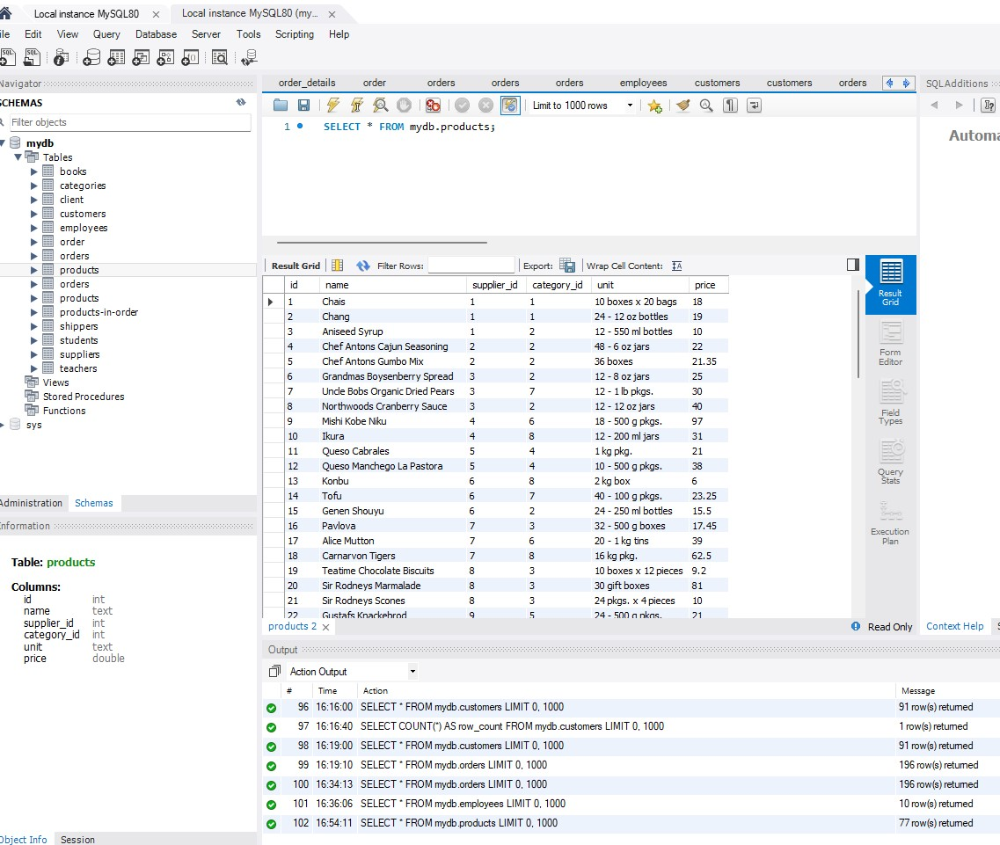
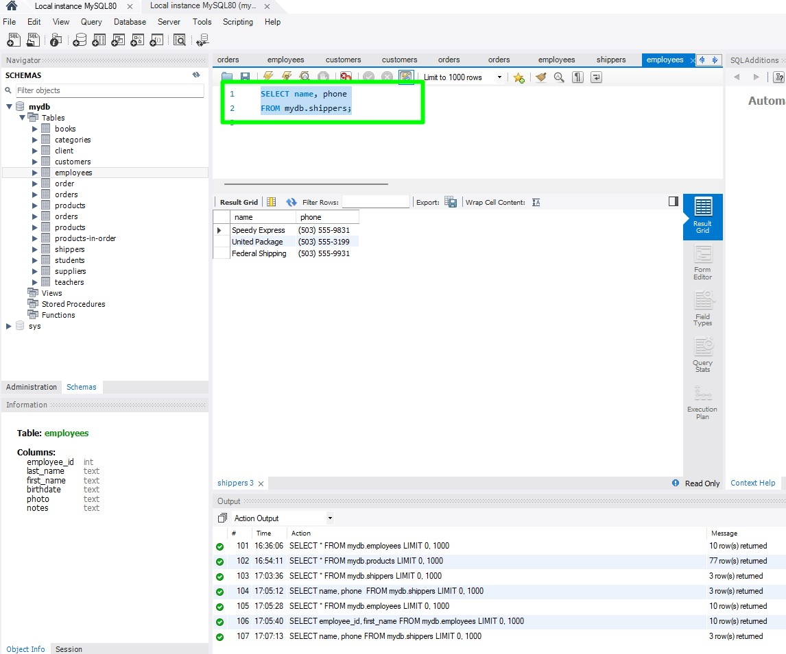
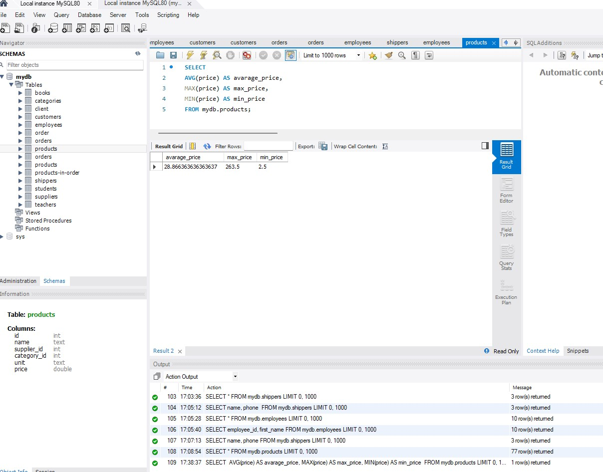
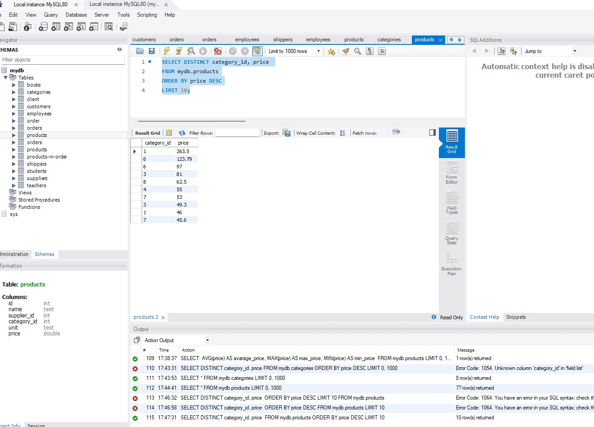
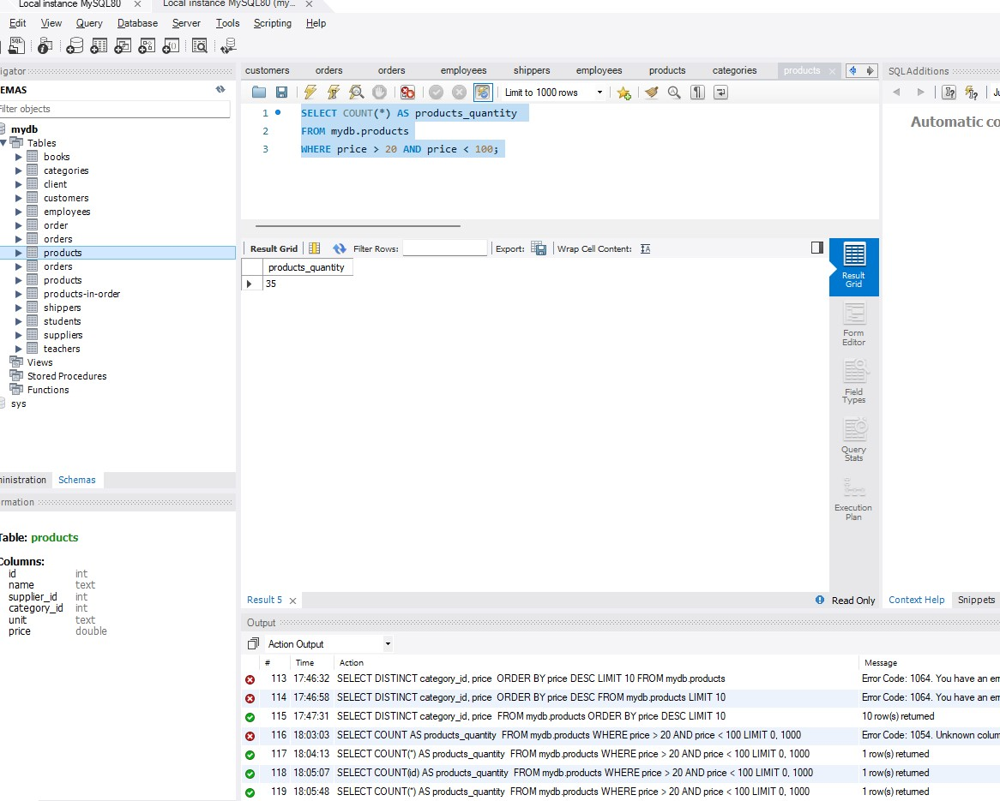
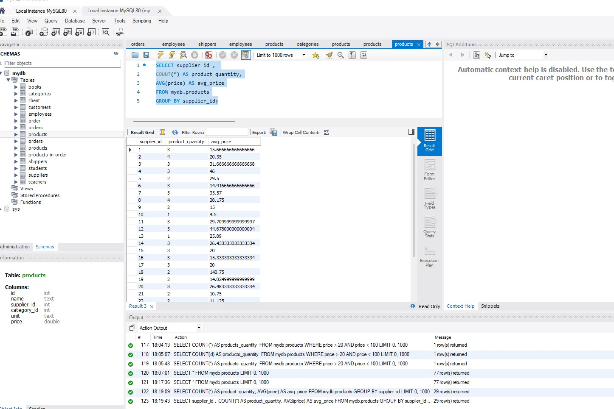

# goit-rdb-hw-03

1. Write an SQL command to:

- Select all columns (using wildcard "\*") from the "products" table.
  
- Select only the columns "name" and "phone" from the "shippers" table.
  Verify its correctness in MySQL Workbench.
  

2. Write an SQL command to find the average, maximum, and minimum value of the "price" column in the "products" table. Verify its correctness in MySQL Workbench.
   

3. Write an SQL command to select unique values of the columns "category_id" and "price". Order the output by descending "price" values and select only 10 rows. Verify its correctness in MySQL Workbench.
   

4. Write an SQL command to find the number of products (rows) that have prices within the range from 20 to 100. Verify its correctness in MySQL Workbench.
   

5. Write an SQL command to find the number of products (rows) and the average price (price) for each supplier (supplier_id). Verify its correctness in MySQL Workbench.
   
